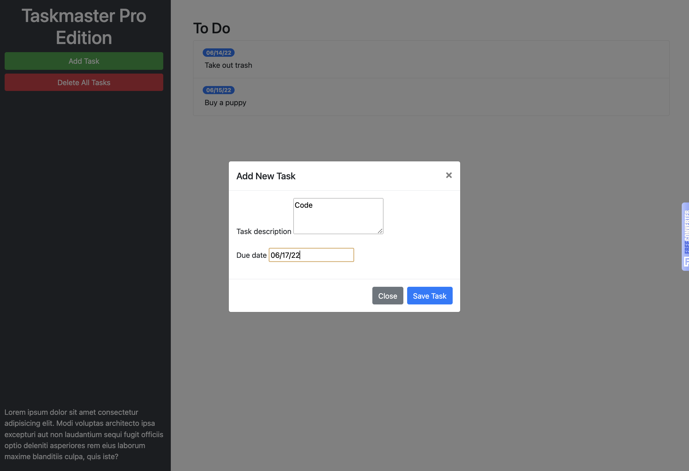

  

<h1 align="center">Taskmaster Pro</h1>

## Description

Taskmaster Pro is a todo list tool where the user can add scheduled tasks to their list. The user also has the ability to delete these tasks.

## Built With

- JavaScript
- HTML
- CSS

## Website

Checkout [Taskmaster-Pro](Taskmaster-Pro is a todo list tool where the user can add scheduled tasks to their list. The user also has the ability to delete these tasks.L).

</a>

## Contribution

Made with ❤️ by Nicole Barranca

## Questions

Feel free to contact me directly at nikkibarranca@gmail.com if you have any questions about the repo.

You can find more of my work at [Nicole Barranca](https://github.com/NicoleBarranca).
